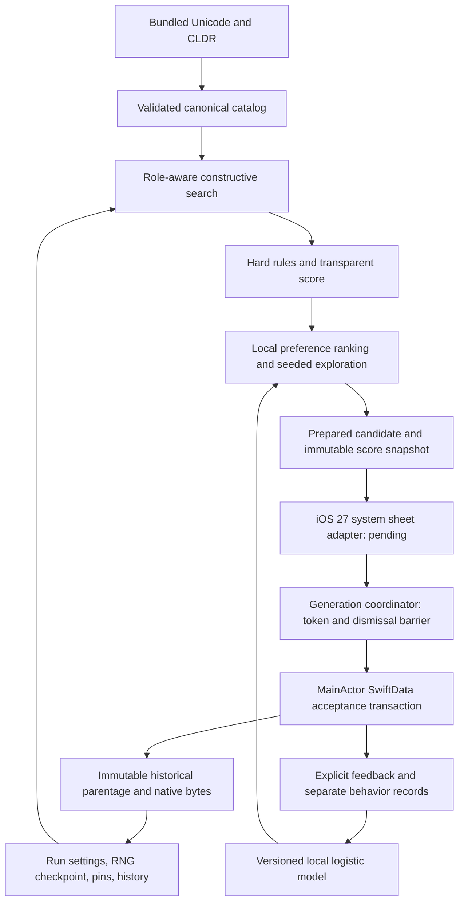

# Architecture

`GlyphCore` has no third-party package dependencies. Pure value types are Sendable. The app moves selection to a detached task and applies results only when its search token still matches; cancelling a superseded search ignores its result. Search work is bounded but its inner loop is not cooperatively cancellable yet.

`LineageStore` is the single MainActor writer. A node UUID provides callback idempotence. Parent ownership/depth, nonempty binary data, catalog namespace and repeat policy are checked before insertion. Saving the node, unique seen entry, active/root IDs and RNG checkpoint is one context save; failures roll back pending changes. SwiftData uses external binary storage and explicitly disables CloudKit. Feedback lives separately from historical node snapshots.

Seen-entry uniqueness uses `catalogVersion|runUUID|rank`; rank remains UInt64 for math and decimal text for persistence. Native glyph content and optional IDs never point to temporary sheet output. History does not retain deleted-run entries. The single-writer guarantee is process-local; adding extensions or multiple persistent writers requires a stronger shared-store concurrency contract.

Schema V1 includes runs, nodes, seen triples, feedback and preference snapshots. The migration plan has one version and no transitions; no migration from a second version has been tested. Changes before first release are not advertised as migrations.

The generation reducer waits for both successful persistence and actual dismissal before advance. A retry after cancellation rotates its session token. A stopped or backgrounded session cannot auto-advance. Presentation, persistence, and advancing are separately guarded. The actual platform host and its cancellation/dismissal wiring are pending.
